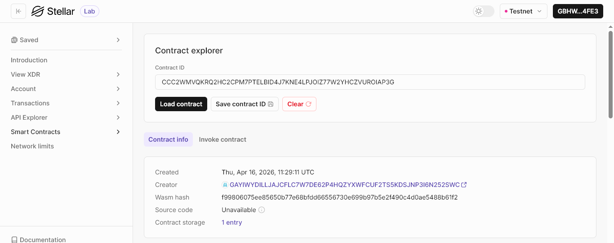

# Stellar Inventory DApp

**Stellar Inventory DApp** - Blockchain-Based Decentralized Storage Management System

## Project Description

Stellar Inventory DApp is a decentralized smart contract solution built on the Stellar blockchain using Soroban SDK. It provides a secure, transparent platform for managing inventory data directly on the blockchain. The contract ensures that all stored items are handled through predefined smart contract functions, eliminating reliance on centralized inventory systems.

The system allows users to add, view, update, and remove inventory items, leveraging the efficiency and security of the Stellar network. Each item is uniquely identified and stored within the contract's instance storage, ensuring data persistence, traceability, and reliability.

## Project Vision

Our vision is to modernize storage and inventory management by:

- **Decentralizing Data**: Moving inventory systems from centralized databases to a distributed blockchain network
- **Ensuring Ownership**: Giving users full control over their inventory records without third-party dependency
- **Guaranteeing Transparency**: Providing a verifiable and auditable record of all inventory operations
- **Enhancing Reliability**: Preventing unauthorized or hidden modifications to inventory data
- **Building Trustless Systems**: Ensuring all operations are validated and enforced by smart contract logic

We envision a future where inventory systems are transparent, tamper-resistant, and globally accessible without centralized control.

## Key Features

### 1. **Item Registration**

- Add new items to the inventory with a single function call
- Define item name, quantity, and storage location
- Automatic ID generation for unique identification
- Persistent on-chain storage

### 2. **Efficient Data Retrieval**

- Retrieve all stored inventory items in one call
- Structured data format for easy frontend integration
- Real-time reflection of current inventory state
- Simplified inventory tracking

### 3. **Stock Management**

- Update item quantities dynamically
- Reflect real-world stock changes directly on-chain
- Maintain accurate inventory levels
- Immediate persistence after updates

### 4. **Secure Item Removal**

- Remove items using unique IDs
- Permanent deletion from storage
- Clean inventory state management
- Consistent synchronization after removal

### 5. **Transparency and Security**

- All inventory operations are visible on-chain
- Verifiable transaction history
- Immutable record of item creation, updates, and deletion
- Protection against unauthorized manipulation

### 5. **Stellar Network Integration**

- Utilizes Stellar’s fast and low-cost transaction system
- Built with Soroban Smart Contract SDK
- Scalable for growing inventory datasets
- Compatible with other Stellar-based applications

## Contract Details

- Contract Address: CCC2WMVQKRQ2HC2CPM7PTELBID4J7KNE4LPJOIZ77W2YHCZVUROIAP3G
  

## Future Scope

### Short-Term Enhancements

1. **Item Categorization**: Add categories or tags for better inventory organization
2. **Batch Operations**: Support bulk addition or removal of items
3. **Low-Stock Alerts**: Implement threshold-based notifications for restocking
4. **Search Functionality**: Enable filtering and searching across inventory items

### Medium-Term Development

5. **Multi-User Access Control**: Role-based permissions for inventory management
   - Admin and operator roles
   - Controlled update and deletion rights
   - Activity tracking per user
6. **Audit Logs**: Maintain detailed logs for all inventory changes
7. **Asset Tokenization**: Represent inventory items as tokenized assets
8. **Inter-Contract Integration**: Enable interaction with supply chain or logistics contracts

### Long-Term Vision

9. **Cross-Chain Inventory Sync**: Extend inventory tracking across multiple blockchains
10. **Decentralized Dashboard**: Host UI on IPFS or similar decentralized platforms
11. **AI-Based Forecasting**: Predict stock requirements using AI models
12. **Privacy Layers**: Selective disclosure of inventory data using cryptographic methods
13. **DAO Governance**: Community-driven control over contract upgrades
14. **Supply Chain Integration**: End-to-end tracking from production to delivery

### Enterprise Features

15. **Warehouse Management Systems**: Adaptation for large-scale enterprise logistics
16. **Immutable Audit Trails**: Compliance-ready audit logs for regulatory needs
17. **Automated Restocking**: Smart triggers for inventory replenishment
18. **Multi-Language Support**: Global usability with localization support

---

## Technical Requirements

- Soroban SDK
- Rust programming language
- Stellar blockchain network

## Getting Started

Deploy the smart contract to Stellar's Soroban network and interact with it using the core functions:

- `add_item()` - Add a new item with name, quantity, and location
- `get_items()` - Retrieve all stored inventory items
- `remove_item()` - Delete an item by its ID
- `update_quantity()` - Update stock quantity of an existing item

---

**Stellar Inventory DApp** - Managing Assets Transparently on the Blockchain